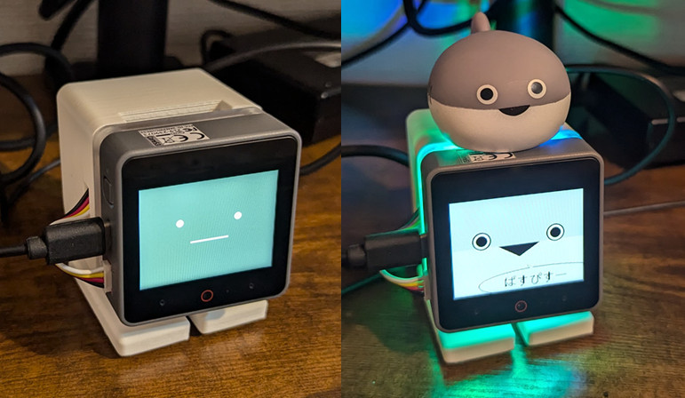

# m5stack-avatar-with-RGB-Bottom

M5Stack CoreS3ベースのｽﾀｯｸﾁｬﾝにハシビロ工業さんのRGBボトムを組み合わせたサンプルです。

サーボモーターはPWMタイプを想定しています。

また、サーボモータの接続はCoreS3の側面にあるPoat.Aをデフォルトとしています。
（RGBボトムを接続する関係上、Poat.B, Cが付いているCoreS3標準のボトムを外す必要があるため）

## 実行環境・機材

- HW
  - [M5Stack CoreS3](https://www.switch-science.com/products/8960)
  - [ハシビロ工業 RGB ボトム for CoreS3](https://www.switch-science.com/products/9815)
  - [ｽﾀｯｸﾁｬﾝのケースやサーボ用基盤など](https://mongonta.booth.pm/)
- SW
  - 本サンプルアプリ
  - VS Code
  - PlatformIO（VS Codeの拡張機能でインストールする想定）

## 使用方法

本サンプルの機能は次の3つだけです。

- Aボタン
  - 「こんにちわ」という台詞が出ます。
- Bボタン
  - サーボモーターの動作確認（首を上下に振ります）
- Cボタン
  - 顔が変化し、RGBボトムがしばらく点灯します。

## 参考

### my-stack-chan-DIY-Base

@mongonta0716さんが公開されている [stack-chan-tester](https://github.com/mongonta0716/stack-chan-tester/) をベースにした、Avaterプログラムでよく使うコードを簡単にまとめたサンプルプログラム
https://github.com/u-tanick/my-stack-chan-DIY-Base

### M5Stack CoreS3・SE向けRGBボトム：ハシビロ工業

M5Stack CoreS3、SEの底面にRGBLEDを追加するハードウエアの動作サンプル
https://github.com/HSBL-ko-gyo/HSBL-S200-01/

